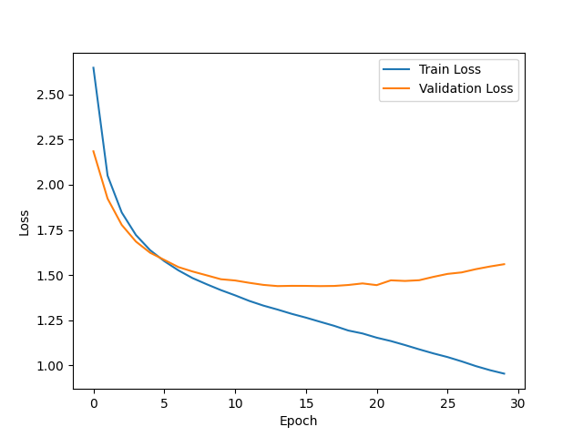
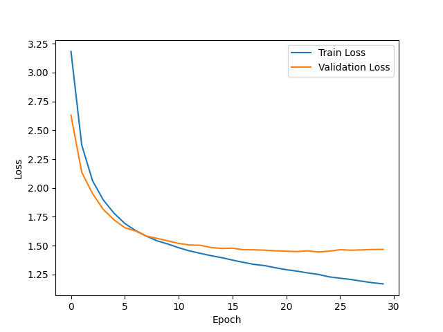

# HW3

# Character-Level Language Modeling with RNN and LSTM
## - Shakespeare Dataset을 활용한 실험 -

### 1. 소개
이 보고서에서는 Shakespeare 데이터셋을 사용하여 문자 단위 언어 모델링 실험을 수행한 결과를 다룹니다. 바닐라 RNN(Recurrent Neural Network)과 LSTM(Long Short-Term Memory) 모델을 구현하고, 이들의 성능을 비교 분석하였습니다.

### 2. 데이터셋
실험에는 Shakespeare 데이터셋을 사용하였습니다. 이 데이터셋은 Shakespeare의 작품에서 발췌한 텍스트로 구성되어 있습니다. 데이터셋은 문자 단위로 처리되었으며, 각 문자는 고유한 인덱스로 매핑되었습니다.

### 3. 모델 구조
바닐라 RNN (CharRNN): 기본적인 RNN 구조로, 임베딩 층, RNN 층, 출력 층으로 구성됩니다.
- hidden layer size: 512
- number of layers: 3
LSTM (CharLSTM): RNN 대신 LSTM 층을 사용한 모델로, 장기 의존성을 더 잘 포착할 수 있습니다.
- hidden layer size: 512
- number of layers: 3

Optimization 초기에 모델은 hidden layer size = 128, number of layers = 5로 Adam 사용하여 학습을 진행했습니다. LSTM이 RNN에 비해 성능이 떨어지는 현상이 관찰되었습니다. 이를 해결하기위해 아래와 같이 설정하였습니다.

hidden layer size를 128 -> 512
number of layer를 5 -> 3
Adam -> AdamW 

Hidden Layer Size 증가:
Hidden layer size를 증가시키면 모델의 표현력이 커집니다. 더 많은 뉴런을 사용하여 더 복잡한 패턴을 학습할 수 있게 됩니다.
특히 Shakespeare 데이터셋과 같이 어휘량이 많고 문맥 의존성이 높은 데이터에서는 더 큰 hidden layer size가 도움이 될 수 있습니다.

Number of Layers 감소:
초기에 5개의 층을 사용했을 때 LSTM의 성능이 RNN보다 낮았던 것은, LSTM의 깊이가 너무 깊어졌기 때문일 수 있습니다.
LSTM은 각 층마다 게이트와 메모리 셀을 가지고 있어 이미 깊은 구조를 가지고 있습니다. 따라서 층을 너무 많이 쌓으면 오히려 기울기 소실이나 과적합 문제가 발생할 수 있습니다.
층의 수를 줄임으로써 모델의 복잡도를 낮추고, 학습 안정성을 높일 수 있습니다.

AdamW 옵티마이저 사용:
AdamW는 Adam 옵티마이저의 변형으로, 가중치 감쇠(Weight Decay)를 별도로 적용합니다.
가중치 감쇠는 모델의 가중치 값이 너무 커지는 것을 방지하여 과적합을 억제하는 효과가 있습니다.
Adam에 가중치 감쇠를 추가한 AdamW를 사용함으로써, 모델의 일반화 성능을 향상시킬 수 있습니다.

### 4. 학습 과정
각 모델은 30 에포크 동안 학습되었습니다. 배치 크기는 128로 설정하였고, AdamW 옵티마이저와 교차 엔트로피 손실 함수를 사용하였습니다. 학습률은 0.001로 설정하였습니다.

### 5. 실험 결과
#### 5.1. 학습 및 검증 손실 그래프
첨부된 그래프 (Image 1, Image 2)는 각 모델의 에포크에 따른 학습 손실과 검증 손실을 보여줍니다. 두 모델 모두 학습이 진행됨에 따라 손실이 감소하는 경향을 보입니다. 그러나 CharLSTM 모델이 CharRNN 모델보다 전반적으로 더 낮은 손실 값을 보이며, 더 안정적인 학습 곡선을 나타냅니다.
##### 1. RNN

##### 2. LSTM

#### 5.2. 언어 생성 성능
각 모델을 사용하여 생성한 샘플 텍스트는 첨부된 파일 (generated_RNN.txt, generated_LSTM.txt)에서 확인할 수 있습니다. 생성된 텍스트를 비교해 보면, CharLSTM 모델이 CharRNN 모델보다 더 자연스럽고 문법적으로 올바른 문장을 생성하는 경향이 있음을 알 수 있습니다. CharRNN 모델은 때로는 부자연스러운 단어나 구문을 생성하는 반면, CharLSTM 모델은 Shakespeare의 작품 스타일을 더 잘 모방하고 있습니다.

#### 5.3. 온도 매개변수의 영향
생성 과정에서 온도 매개변수를 조절하여 생성되는 텍스트의 다양성과 그럴듯함을 제어할 수 있습니다. 낮은 온도 값은 더 확실한 예측을 하도록 하여 더 그럴듯한 텍스트를 생성하지만 다양성은 줄어들 수 있습니다. 반면, 높은 온도 값은 더 다양한 텍스트를 생성하지만 문법적 오류나 부자연스러운 표현이 늘어날 수 있습니다. 적절한 온도 값을 찾는 것이 중요합니다.

### 6. 결론
이 실험을 통해 문자 단위 언어 모델링에서 LSTM 모델이 바닐라 RNN 모델보다 더 우수한 성능을 보임을 확인하였습니다. LSTM의 장기 의존성 포착 능력이 Shakespeare 데이터셋의 스타일과 문법 구조를 더 잘 모델링할 수 있게 해주는 것으로 보입니다. 또한 온도 매개변수를 적절히 조절하여 생성 텍스트의 품질을 향상시킬 수 있음을 알 수 있었습니다.

향후에는 더 깊은 구조의 모델, Attention 메커니즘 등을 적용하여 모델의 성능을 더욱 향상시켜 볼 수 있을 것입니다. 또한 다양한 하이퍼파라미터 설정과 데이터 전처리 기법을 실험해 보는 것도 흥미로운 주제가 될 수 있겠습니다.
