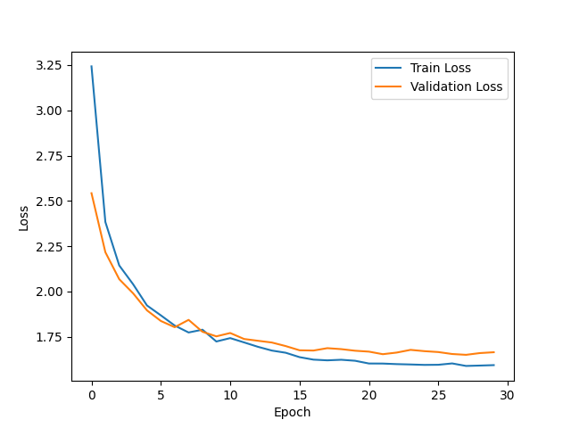

# HW3

# Character-Level Language Modeling with RNN and LSTM
## - Shakespeare Dataset을 활용한 실험 -

### 1. 소개
이 보고서에서는 Shakespeare 데이터셋을 사용하여 문자 단위 언어 모델링 실험을 수행한 결과를 다룹니다. 바닐라 RNN(Recurrent Neural Network)과 LSTM(Long Short-Term Memory) 모델을 구현하고, 이들의 성능을 비교 분석하였습니다.

### 2. 데이터셋
실험에는 Shakespeare 데이터셋을 사용하였습니다. 이 데이터셋은 Shakespeare의 작품에서 발췌한 텍스트로 구성되어 있습니다. 데이터셋은 문자 단위로 처리되었으며, 각 문자는 고유한 인덱스로 매핑되었습니다.

### 3. 모델 구조
실험에는 두 가지 모델을 사용하였습니다:
- 바닐라 RNN (CharRNN): 기본적인 RNN 구조로, 임베딩 층, RNN 층, 출력 층으로 구성됩니다.
- LSTM (CharLSTM): RNN 대신 LSTM 층을 사용한 모델로, 장기 의존성을 더 잘 포착할 수 있습니다.

두 모델 모두 입력으로 문자의 인덱스를 받아 임베딩 벡터로 변환한 후, RNN 또는 LSTM 층을 거쳐 출력 층에서 다음 문자의 확률 분포를 생성합니다.

### 4. 학습 과정
각 모델은 30 에포크 동안 학습되었습니다. 배치 크기는 64로 설정하였고, Adam 옵티마이저와 교차 엔트로피 손실 함수를 사용하였습니다. 학습률은 0.001로 설정하였습니다.

### 5. 실험 결과
#### 5.1. 학습 및 검증 손실 그래프
첨부된 그래프 (Image 1, Image 2)는 각 모델의 에포크에 따른 학습 손실과 검증 손실을 보여줍니다. 두 모델 모두 학습이 진행됨에 따라 손실이 감소하는 경향을 보입니다. 그러나 CharLSTM 모델이 CharRNN 모델보다 전반적으로 더 낮은 손실 값을 보이며, 더 안정적인 학습 곡선을 나타냅니다.

#### 5.2. 언어 생성 성능
각 모델을 사용하여 생성한 샘플 텍스트는 첨부된 파일 (generated_RNN.txt, generated_LSTM.txt)에서 확인할 수 있습니다. 생성된 텍스트를 비교해 보면, CharLSTM 모델이 CharRNN 모델보다 더 자연스럽고 문법적으로 올바른 문장을 생성하는 경향이 있음을 알 수 있습니다. CharRNN 모델은 때로는 부자연스러운 단어나 구문을 생성하는 반면, CharLSTM 모델은 Shakespeare의 작품 스타일을 더 잘 모방하고 있습니다.

#### 5.3. 온도 매개변수의 영향
생성 과정에서 온도 매개변수를 조절하여 생성되는 텍스트의 다양성과 그럴듯함을 제어할 수 있습니다. 낮은 온도 값은 더 확실한 예측을 하도록 하여 더 그럴듯한 텍스트를 생성하지만 다양성은 줄어들 수 있습니다. 반면, 높은 온도 값은 더 다양한 텍스트를 생성하지만 문법적 오류나 부자연스러운 표현이 늘어날 수 있습니다. 적절한 온도 값을 찾는 것이 중요합니다.

### 6. 결론
이 실험을 통해 문자 단위 언어 모델링에서 LSTM 모델이 바닐라 RNN 모델보다 더 우수한 성능을 보임을 확인하였습니다. LSTM의 장기 의존성 포착 능력이 Shakespeare 데이터셋의 스타일과 문법 구조를 더 잘 모델링할 수 있게 해주는 것으로 보입니다. 또한 온도 매개변수를 적절히 조절하여 생성 텍스트의 품질을 향상시킬 수 있음을 알 수 있었습니다.

향후에는 더 깊은 구조의 모델, Attention 메커니즘 등을 적용하여 모델의 성능을 더욱 향상시켜 볼 수 있을 것입니다. 또한 다양한 하이퍼파라미터 설정과 데이터 전처리 기법을 실험해 보는 것도 흥미로운 주제가 될 수 있겠습니다.
